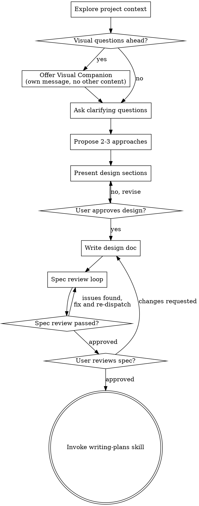

# Brainstorming Ideas Into Designs

Help turn ideas into fully formed designs and specs through natural collaborative dialogue.

Start by understanding the current project context, then ask questions one at a time to refine the idea. Once you understand what you're building, present the design and get user approval.

<HARD-GATE>
Do NOT invoke any implementation skill, write any code, scaffold any project, or take any implementation action until you have presented a design and the user has approved it. This applies to EVERY project regardless of perceived simplicity.
</HARD-GATE>

## Anti-Pattern: "This Is Too Simple To Need A Design"

Every project goes through this process. A todo list, a single-function utility, a config change — all of them. "Simple" projects are where unexamined assumptions cause the most wasted work. The design can be short (a few sentences for truly simple projects), but you MUST present it and get approval.

## Checklist

You MUST create a task for each of these items and complete them in order:

1. **Explore project context** — read the mandatory file list below, verify architecture.md accuracy
2. **Assess brainstorm scope and open WIP state file if needed** — for multi-decision or multi-session brainstorms, open a WIP state file to survive context compact. See the "WIP State File Protocol" section below for trigger conditions and template.
3. **Offer visual companion** (if topic will involve visual questions) — this is its own message, not combined with a clarifying question. See the Visual Companion section below.
4. **Ask clarifying questions** — one at a time, understand purpose/constraints/success criteria
5. **Propose 2-3 approaches** — with trade-offs and your recommendation
6. **Present design and lock decisions** — in sections scaled to their complexity, get user approval after each section. **If WIP file opened, update it immediately after each locked decision — do NOT batch.**
7. **Write design doc** — convert the WIP state file (if any) into a properly structured design spec at `docs/superpowers/specs/YYYY-MM-DD-<topic>-design.md` and commit
8. **Spec review loop** — dispatch spec-document-reviewer subagent with precisely crafted review context (never your session history); fix issues and re-dispatch until approved (max 3 iterations, then surface to human)
9. **User reviews written spec** — ask user to review the spec file before proceeding
10. **Transition to implementation** — invoke writing-plans skill to create implementation plan

## Mandatory Read List (Milestone-Level Work)

For milestone-level brainstorming, "explore project context" means reading these specific files:

| File | Why |
|------|-----|
| `docs/architecture.md` | System state — pages, APIs, DB tables, AI roles, interface contracts, ⚠️ markers |
| `docs/project_status.md` | Current progress, completed milestones, next step |
| `docs/journal/INDEX.md` | Parked ideas that might be relevant to this milestone |
| Previous milestone's spec (if any) | Prior design decisions |
| Related source code | architecture.md tells you which files matter — read them to confirm contracts are still accurate |

The first 4 are always read. The 5th is targeted based on architecture.md interface contracts.

<HARD-GATE>
For milestone-level work: if architecture.md and code are inconsistent, fix architecture.md FIRST before proceeding with design. Do not design on top of stale assumptions.
</HARD-GATE>

## WIP State File Protocol

Large brainstorms often span multiple sessions and risk losing decisions when context compacts. The spec document (final product) is too late — you need a running state file that records each decision the moment it's locked, so a compact or session break doesn't erase progress.

### When to open a WIP file

**Must open** if any of these is true:
- Estimated decision count ≥ 5
- Likely to span multiple sessions (explicit user signal, or research phases that can't finish today)
- Multiple distinct research investigations required before decisions can be made
- User explicitly requests a state file

**Skip** when:
- Single-session brainstorm with < 5 decisions
- Very simple scope (config change, single feature tweak)
- Explicitly agreed with user to use lightweight process

Make this judgment AFTER exploring project context (checklist step 1), BEFORE asking the first clarifying question (checklist step 4). Tell the user you're opening the file and will update it per-decision — the mechanism must be visible, not hidden.

### File location and naming

`docs/superpowers/specs/YYYY-MM-DD-<topic>-brainstorm-state.md`

Same directory as the final design spec, with `-brainstorm-state` suffix. Use the date of brainstorm start (not today's date if brainstorm is resumed from a prior session).

### Required structure (template)

```markdown
# <Topic> Brainstorm 进行中状态（WIP）

**创建日期**: YYYY-MM-DD
**用途**: compact 防御——记录 brainstorm 进度，避免 session 断档丢失状态
**最终产出**: `docs/superpowers/specs/YYYY-MM-DD-<topic>-design.md`

> ⚠️ compact 后恢复时**先读这个文件**，不要从 summary 重建——summary 会丢细节。

---

## 基础设定（不会变）

[Invariants for this brainstorm — product constraints, strategic positioning, rules locked in before brainstorm or very early. Everything downstream depends on these; they must be stable.]

---

## 调研

[List of research files relevant to this brainstorm, with a one-line note on what each found. Include paths so future sessions can re-read.]

---

## 已拍死的决策（不再讨论）

### 决策 N：<标题> (YYYY-MM-DD 拍板)

[Full detail of what was decided, why, and implications. NOT a summary — enough to reconstruct reasoning months later. Include rejected alternatives and the reason for rejection so the decision doesn't get re-opened naively.]

---

## 待 brainstorm 的决策（按依赖顺序）

### 决策 N：<标题>【下一个】

[Open questions, constraints, expected output format, what must be answered before downstream decisions can proceed.]

### 决策 N+1：<标题>

[Placeholder for future decisions; fill in progressively.]

---

## 当前进度

- ✅ 决策 1（已拍板）
- ✅ 决策 2（已拍板）
- 🔄 下一步：决策 3
- ⏳ 剩余：决策 4, 5, ...

---

## 最终产出

[What will happen when brainstorm completes — transition path to formal spec, and whether this WIP file is deleted or archived.]
```

### Running rules (MUST follow)

- **After each decision is locked**: immediately update the WIP file. Do NOT batch multiple decisions before updating — one compact can wipe the unsaved batch.
- **At session start (including compact recovery)**: read the WIP file FIRST. Do NOT rebuild state from the conversation summary — summaries drop detail, especially sub-decision rationale and rejected alternatives.
- **Memory pointer**: add a `project`-type entry to `MEMORY.md` pointing to the WIP file. This helps future sessions discover the in-progress brainstorm even if they don't read INDEX.md. Remove the pointer when brainstorm completes.
- **Inform the user**: tell them you've opened a WIP file and will update it per-decision. This builds trust and makes the mechanism visible — users should not discover it accidentally.

### Transition to formal spec

When all decisions are locked, checklist step 7 ("Write design doc") converts the WIP file into the formal spec:
1. Organize the spec by engineering concern (data model / APIs / UI / testing), NOT by brainstorm decision order
2. The WIP file can be deleted (all info migrated to spec) or retained as a decision trail — user preference
3. Remove the MEMORY.md pointer created for this brainstorm
4. Proceed to spec review loop (checklist step 8)

## Process Flow



**The terminal state is invoking writing-plans.** Do NOT invoke frontend-design, mcp-builder, or any other implementation skill. The ONLY skill you invoke after brainstorming is writing-plans.

## The Process

**Understanding the idea:**

- Check out the current project state first (files, docs, recent commits)
- Before asking detailed questions, assess scope: if the request describes multiple independent subsystems (e.g., "build a platform with chat, file storage, billing, and analytics"), flag this immediately. Don't spend questions refining details of a project that needs to be decomposed first.
- If the project is too large for a single spec, help the user decompose into sub-projects: what are the independent pieces, how do they relate, what order should they be built? Then brainstorm the first sub-project through the normal design flow. Each sub-project gets its own spec → plan → implementation cycle.
- For appropriately-scoped projects, ask questions one at a time to refine the idea
- Prefer multiple choice questions when possible, but open-ended is fine too
- Only one question per message - if a topic needs more exploration, break it into multiple questions
- Focus on understanding: purpose, constraints, success criteria

**Exploring approaches:**

- Propose 2-3 different approaches with trade-offs
- Present options conversationally with your recommendation and reasoning
- Lead with your recommended option and explain why

**Presenting the design:**

- Once you believe you understand what you're building, present the design
- Scale each section to its complexity: a few sentences if straightforward, up to 200-300 words if nuanced
- Ask after each section whether it looks right so far
- Cover: architecture, components, data flow, error handling, testing
- Be ready to go back and clarify if something doesn't make sense

**Design for isolation and clarity:**

- Break the system into smaller units that each have one clear purpose, communicate through well-defined interfaces, and can be understood and tested independently
- For each unit, you should be able to answer: what does it do, how do you use it, and what does it depend on?
- Can someone understand what a unit does without reading its internals? Can you change the internals without breaking consumers? If not, the boundaries need work.
- Smaller, well-bounded units are also easier for you to work with - you reason better about code you can hold in context at once, and your edits are more reliable when files are focused. When a file grows large, that's often a signal that it's doing too much.

**Working in existing codebases:**

- Explore the current structure before proposing changes. Follow existing patterns.
- Where existing code has problems that affect the work (e.g., a file that's grown too large, unclear boundaries, tangled responsibilities), include targeted improvements as part of the design - the way a good developer improves code they're working in.
- Don't propose unrelated refactoring. Stay focused on what serves the current goal.

## After the Design

**Documentation:**

- Write the validated design (spec) to `docs/superpowers/specs/YYYY-MM-DD-<topic>-design.md`
  - (User preferences for spec location override this default)
- Use elements-of-style:writing-clearly-and-concisely skill if available
- Commit the design document to git

**Spec Deep Review Loop:**
After writing the spec document:

1. **Build the agent prompt** using the template in `spec-document-reviewer-prompt.md`:
   - Identify all source files in the spec's change list
   - Identify relevant architecture.md interface contracts
   - Fill the template with these file paths
2. **Dispatch a general-purpose Agent** with the constructed prompt. The agent reads the spec + architecture.md + related source code, then reviews against 5 dimensions (interface consistency, change list completeness, data flow, cross-module side effects, internal consistency).
3. **Process the result together with user:**
   - Critical issues → must fix, re-dispatch agent
   - Important issues → show to user, user decides
   - Minor only → list but don't block
   - APPROVED → proceed to user review gate
4. If loop exceeds 3 iterations, surface to human for guidance

**User Review Gate:**
After the spec review loop passes, ask the user to review the written spec before proceeding:

> "Spec written and committed to `<path>`. Please review it and let me know if you want to make any changes before we start writing out the implementation plan."

Wait for the user's response. If they request changes, make them and re-run the spec review loop. Only proceed once the user approves.

**Implementation:**

- Invoke the writing-plans skill to create a detailed implementation plan
- Do NOT invoke any other skill. writing-plans is the next step.

## Key Principles

- **One question at a time** - Don't overwhelm with multiple questions
- **Multiple choice preferred** - Easier to answer than open-ended when possible
- **YAGNI ruthlessly** - Remove unnecessary features from all designs
- **Explore alternatives** - Always propose 2-3 approaches before settling
- **Incremental validation** - Present design, get approval before moving on
- **Be flexible** - Go back and clarify when something doesn't make sense
- **WIP state file for large brainstorms** - If the brainstorm has 5+ decisions or may span sessions, open a WIP state file (see "WIP State File Protocol") after exploring context and update it after every locked decision. Spec documents are the final product; WIP files are the lifeline that protects progress from context compact.

## Visual Companion

A browser-based companion for showing mockups, diagrams, and visual options during brainstorming. Available as a tool — not a mode. Accepting the companion means it's available for questions that benefit from visual treatment; it does NOT mean every question goes through the browser.

**Offering the companion:** When you anticipate that upcoming questions will involve visual content (mockups, layouts, diagrams), offer it once for consent:
> "Some of what we're working on might be easier to explain if I can show it to you in a web browser. I can put together mockups, diagrams, comparisons, and other visuals as we go. This feature is still new and can be token-intensive. Want to try it? (Requires opening a local URL)"

**This offer MUST be its own message.** Do not combine it with clarifying questions, context summaries, or any other content. The message should contain ONLY the offer above and nothing else. Wait for the user's response before continuing. If they decline, proceed with text-only brainstorming.

**Per-question decision:** Even after the user accepts, decide FOR EACH QUESTION whether to use the browser or the terminal. The test: **would the user understand this better by seeing it than reading it?**

- **Use the browser** for content that IS visual — mockups, wireframes, layout comparisons, architecture diagrams, side-by-side visual designs
- **Use the terminal** for content that is text — requirements questions, conceptual choices, tradeoff lists, A/B/C/D text options, scope decisions

A question about a UI topic is not automatically a visual question. "What does personality mean in this context?" is a conceptual question — use the terminal. "Which wizard layout works better?" is a visual question — use the browser.

If they agree to the companion, read the detailed guide before proceeding:
`skills/brainstorming/visual-companion.md`

---

## Chain Position

This skill is the **entry point** of the **Design Chain**:
1. **brainstorming** ← you are here
2. writing-plans
3. _(user decides: dispatch or execute)_

**Next step:** After user approves the spec, invoke `writing-plans` automatically. This is already specified in the checklist above — this note reinforces the chain.
