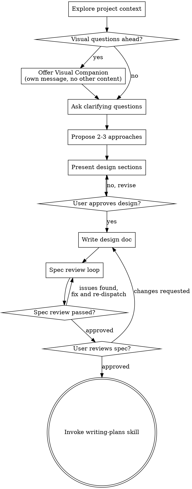
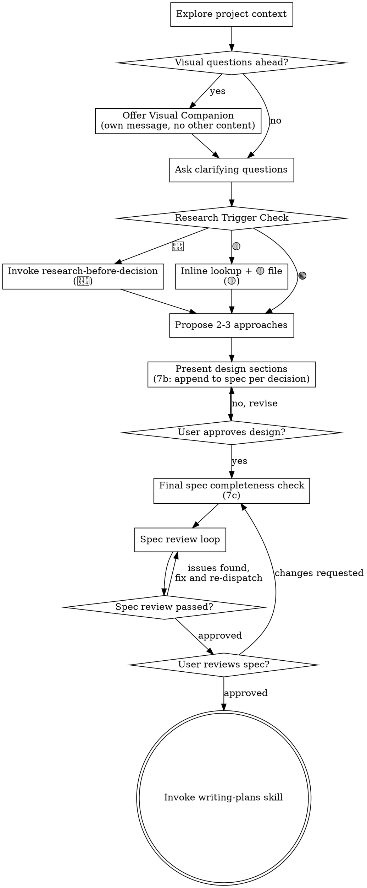

# Research Capability Implementation Plan

> **For agentic workers:** REQUIRED SUB-SKILL: Use superpowers:subagent-driven-development (recommended) or superpowers:executing-plans to implement this plan task-by-task. Steps use checkbox (`- [ ]`) syntax for tracking.

**Goal:** 把"调研能力"从依赖 memory 的软约束升级为显式 skill + brainstorming 硬挂钩，让 Claude 在做关键决策前必须引用权威源（多信号加权 ≥3 条），不得用训练记忆凑数。

**Architecture:** 新建 `research-before-decision` skill 承载 🔴 重度调研完整流程（10 步 + 双模板 + sub-agent 并行 + 5 问硬 gate + 落盘知识库）；改 `brainstorming` skill 插入 Research Trigger Check（按 🟢🟡🔴 分诊）+ 把 spec 批量写拆成 7a/7b/7c 增量写（BS-1）+ 🟡 轻量调研也落盘成知识库文件。CLAUDE.md 只加一行指针。MEMORY.md 合并现有 `feedback_research-before-recommendation` 为指向 skill 的指针。

**Tech Stack:** 纯 markdown（skill 文件 + 配置文件），无代码变更。验证方式是**结构化 read-back**（frontmatter、cross-ref、checklist 编号）而非单元测试。

**Spec reference:** `docs/superpowers/specs/2026-04-14-research-capability-design.md`

---

## File Structure

| 文件 | 动作 | 责任 |
|---|---|---|
| `.claude/skills/research-before-decision/SKILL.md` | **新建** | 🔴 重度调研全流程规格：触发、模板、运行步骤、sub-agent 派发、5 问硬 gate、落盘格式 |
| `.claude/skills/brainstorming/SKILL.md` | **修改** | 插 Research Trigger Check 节、checklist + DOT 流程图更新、step 7 拆 7a/7b/7c、🟡 轻量调研落盘规则 |
| `CLAUDE.md` | **修改** | "Skill 使用"段新增一行指向 research-before-decision skill |
| `C:\Users\Administrator\.claude\projects\D------Users-Sean-ai-textbook-teacher\memory\feedback_research-before-recommendation.md` | **重写** | 压缩为指向 skill 的一行 + 保留"Why"段落作为历史事故记录 |
| `C:\Users\Administrator\.claude\projects\D------Users-Sean-ai-textbook-teacher\memory\MEMORY.md` | **修改** | 更新 research feedback 条目描述；本 brainstorm 完成后**不移除** `project_research-capability-brainstorm.md` 指针——等 T6 验证完统一删 |
| `C:\Users\Administrator\.claude\projects\D------Users-Sean-ai-textbook-teacher\memory\project_research-capability-brainstorm.md` | **删除** | brainstorm 已完成，WIP 指针不再需要 |

**不动的文件**：`docs/decisions.md`（ADR 迁移本次不做）、`docs/research/*.md` 22 个旧文件（不强制迁移）、CLAUDE.md 的 5 问段落文字（不改）、`src/**`（Claude 文件边界外）。

---

## Task 1: 新建 `research-before-decision` SKILL.md

**Files:**
- Create: `.claude/skills/research-before-decision/SKILL.md`

- [ ] **Step 1: 创建目录 + 写 SKILL.md 全文**

路径：`D:/已恢复/Users/Sean/ai-textbook-teacher/.claude/skills/research-before-decision/SKILL.md`

完整内容（按 spec §4.1-§4.6 + §3.1-§3.2 展开；frontmatter 仿 brainstorming skill 格式）：

````markdown
---
name: research-before-decision
description: "You MUST use this before recommending any 🔴 tier decision (3+ options / hard to reverse / cross-domain expert knowledge / referenced by multiple downstream decisions / user explicitly requests). Executes multi-dimensional research with authority-weighted source quality grading, dispatches one sub-agent per dimension, produces a durable knowledge-base file at docs/research/YYYY-MM-DD-<topic>.md, and enforces the CLAUDE.md 5-question hard gate before returning."
---

# Research Before Decision

做关键决策前的结构化调研 skill。核心约束：**不允许用训练记忆凑数**，每个数字/引用必须带 URL，源质量按 S/A/B 多信号加权，5 问表格硬 gate。

参考样例：`docs/research/2026-04-14-how-to-research-before-decisions.md` 是本 skill 诞生的 meta 调研，也是输出格式的参考范本。

---

## When to Use (Triage)

| 档 | 触发条件（满足任一） | 动作 |
|---|---|---|
| 🟢 不调研 | 纯代码实现选择 / 项目内已有答案 / 仅影响当前模块（易反悔） | 直接决定，**不调用本 skill** |
| 🟡 轻量调研 | 单点事实核对 / ≤2 选项 / 决策易反悔 / 结论只服务当前决策 | 调用方（通常是 brainstorming）当场 WebSearch/WebFetch 并落 🟡 轻模板文件，**不调用本 skill** 长流程 |
| 🔴 重度调研 | 3+ 选项对比 / 决策难反悔 / 跨领域专家知识 / 结论会被后续多决策引用 / 用户明确要求 | **必须调用本 skill** 完整 10 步 |

<HARD-GATE>
CLAUDE.md 标注"难以反悔"的决策**默认走 🔴**，不得降级。
</HARD-GATE>

---

## Source Quality Standard (S/A/B + 硬拒绝)

**核心原则**：不信任单一指标（h-index、GitHub star、Twitter 粉丝、博客阅读量都可刷或已脱钩）。必须多信号交叉验证。

### S 级 = 满足以下 ≥3 条

1. 持续产出 ≥5 年（博客、书、论文等）
2. 机构联属（成熟企业 Tech Lead / Chief X、高校教职、研究所）
3. 有可查的经典作品（书、开创性博客、被广泛引用的论文）
4. 被其他 S 级权威公开引用/致谢（师承链可追溯）
5. 在重大方法论事件里留名（敏捷宣言、RFC 作者、HTTP 协议等）
6. 演讲/会议 keynote 记录（OSCON、Strange Loop、ICML、QCon 等）

**S 级典型**：Simon Willison、Martin Fowler、Kent Beck、Andrej Karpathy、Michael Nygard；Thoughtworks / Google / Stripe / Anthropic 官方工程博客；方法论原始出处；同行评议论文；官方文档。

### A 级 = 不满足 S 的 ≥3 条但来自署名且有可查背景的技术产出

- 2024-2026 有署名技术媒体（InfoQ、LeadDev、ACM、Nature）
- 实名工程师会议演讲（未到 keynote 级别）
- 单机构工程博客不满足 S 级门槛的

**使用规则**：S 缺席才用，显式标 `[A]`。

### B 级 = 社区意见

- HN / Reddit 高赞讨论 + domain expert 留言
- GitHub Issue 讨论里的 maintainer 回复（若 maintainer 未达 S 级）

**使用规则**：S、A 都缺席才用，显式标 `[B · 社区意见]`。

**B 级嫌疑信号**（遇到以下任一则从 A 降到 B）：
- 产出只在 Medium / LinkedIn post
- 没被其它 S 级作者引用
- 自称 "thought leader" 但无公开经典作品
- Twitter/X 粉丝多但无深度产出

### 硬拒绝（0 容忍，违规 = skill 违规）

- 无日期博客、SEO 列表文、"Top 10 Best X 2025"
- Medium 内容农场、AI slop（完美语法 + 空泛 + 无具体细节）
- AI 生成摘要无原始出处
- **Claude 训练记忆**

**查不到必须写"没查到"**，不得凭训练记忆凑数。

---

## Run Sequence（10 步）

1. **判断档位**：确认当前议题确实是 🔴（否则返回调用方，让它走轻量路径）
2. **选模板**：
   - **模板 A · 战略选型决策**（"要不要用 X / 选 A 还是 B"）：1. 它是什么 / 2. 现在的代价 / 3. 带来什么能力 / 4. 关闭哪些门 / 5. 选错后果
   - **模板 B · 实施方案决策**（"怎么做不炸"）：1. 当前状态 as-is / 2. 目标状态 to-be / 3. 迁移路径 / 4. 回滚方案 / 5. 验证策略
3. **追加项目永久维度**（每次强制）：中国可达性 / 成本档位（MVP 烧钱敏感）/ 是否违反 CLAUDE.md 产品不变量
4. **Claude 临场补 2-4 个项目特定维度**，列给用户审批后才动
5. **确认源质量档位**：默认 §Source Quality Standard 的 S 级优先、允许降级显式标级
6. **执行调研**：**每维度派一个 general-purpose sub-agent 并行跑**（见下方 Sub-Agent Dispatch），主 Claude 只做聚合。🟡 不进这一步
7. **产出文件**：`docs/research/YYYY-MM-DD-<topic-slug>.md`（slug 小写英文连字符、ASCII-only），结构见 §Output File Format
8. **调研收尾自检**：S/A/B 源分布统计 + URL 逐个验证可打开 + 幻觉自查声明
9. **5 问硬 gate 自检**：必须产出完整 5 问表格（模板 A）或完整 5 段（模板 B），缺任一条 = skill 违规，仅允许显式 `N/A: <原因>`。未通过返回步骤 6/7 补齐，不得进入步骤 10
10. **返回调用方**

---

## Sub-Agent Dispatch（步骤 6 细节）

🔴 重度调研启动后，维度清单审批通过时，**每个维度派一个独立 general-purpose sub-agent 并发执行**。

**为什么用 sub-agent**：
- 主对话上下文不被 WebSearch/WebFetch 原文挤爆
- 并行节省 wall-clock 时间
- 每个 agent 专注单维度，深度更高

**Sub-agent prompt 必须包含**（"smart colleague who just walked into the room"风格）：

1. **维度名 + 要回答的具体问题**（给足 topic 背景，不能让 agent 自己猜）
2. **完整源质量标准**（把 §Source Quality Standard 的 S/A/B + 硬拒绝清单整段贴进 prompt）
3. **深度档位**：用户选定的 2-3 / 3-5 / 5+ 源
4. **结构化返回格式**：每条发现必须含【引述 + URL + 级别 (S/A/B) + 对项目启示】
5. **固定约束**：`the user is a non-technical CEO; cite URL for every claim; never use training memory; flag uncertainty explicitly as "没查到"; do NOT fabricate`

**Prompt 模板示例**（按需替换 `{...}` 字段）：

```
Task tool (general-purpose):
  description: "Research dimension: {dimension_name}"
  prompt: |
    You are researching one dimension of a project decision.

    ## Topic Context
    {topic — 1-3 sentences giving the decision background}

    ## Your Dimension
    {dimension_name} — {question to answer}

    ## Source Quality Standard (mandatory)
    {Paste §Source Quality Standard S/A/B + hard-reject list here verbatim}

    ## Depth
    Return {N} sources minimum, {M} maximum. Prefer S-tier; only drop to A if S is absent; only drop to B if both are absent. Label every source explicitly.

    ## Output Format
    For each finding:
    - **Claim**: <one-sentence finding>
    - **Quote**: <direct quote from source, ≤40 words>
    - **URL**: <link — must be openable, 2024-2026 preferred>
    - **Tier**: [S | A | B · reason]
    - **Project implication**: <how this affects the current decision>

    ## Fixed Constraints
    - The user is a non-technical CEO; no jargon-dump, use life analogies
    - Every number / named entity MUST have a URL
    - If you cannot find a source, write "没查到: <what was searched>" — DO NOT fabricate from training memory
    - If uncertain, flag explicitly ("uncertain: ...")
```

**并行派发**：所有 sub-agent 放在 ONE message 的多个 Agent 工具调用里，而不是串行。

**聚合**：主 Claude 收齐所有返回后，按 §Output File Format 整合成单一文件；执行步骤 8（源质量自审）和步骤 9（5 问硬 gate）。

---

## Output File Format（步骤 7）

### 🔴 重度模板

**文件名**：`docs/research/YYYY-MM-DD-<topic-slug>.md`（slug 小写英文连字符、ASCII-only）

**Frontmatter 硬字段**（缺则违规）：

```yaml
---
date: YYYY-MM-DD
topic: <中文简述>
triage: 🔴
template: A | B
budget: <实际耗时 min>
sources: { S: N, A: N, B: N }
---
```

**Body 灵活**：不同 topic 可用对比表 / 段落论证 / bullet，不强制结构。

**必选末段 · 源质量自审**（缺则违规）：
- S/A/B 源数量统计
- URL 全部验证可打开（✅/❌）
- 幻觉自查声明："所有数字/引用来自引用源，非训练记忆"

### 🟡 轻模板（调用方自行落盘，不走本 skill 长流程）

**Frontmatter**：

```yaml
---
date: YYYY-MM-DD
topic: <中文简述>
triage: 🟡
scope: <单点事实 | ≤2 选项 | 易反悔 | 只服务当前决策>
budget: <实际耗时 min，通常 10-20>
sources: { S: N, A: N, B: N }
---
```

**Body 极简三段**：
- **问题**（一行陈述）
- **发现**（bullet：摘录 + [URL] + [S/A/B]）
- **结论**（一行，对当前决策的影响）

**源质量自审末段保留**。

---

## 5-Question Hard Gate（步骤 9）

**硬 gate**：步骤 9 在返回调用方前执行。必须产出完整 5 问表格（模板 A）或完整 5 段（模板 B），缺任一条 = skill 违规。

**唯一豁免**：允许显式写 `N/A: <原因>`（例如"单选项决策，无替代可比较"）。不允许默默跳过。

**理由**：软规则让 AI 自己判断何时跳过 = 自我监督悖论。硬 gate 把判断外包给规则本身，Claude 只能执行或显式声明 N/A。

---

## Reference Example

`docs/research/2026-04-14-how-to-research-before-decisions.md` —— 本 skill 诞生的 meta 调研。D1-D5 覆盖 Vibe coding / 工程决策模板 / 源质量 / 分档框架 / 权威识别，22 个 S 级源 + 10 个 A 级源，末段有完整源质量自审。**新调研产出时可照此格式写**。

存量 `docs/research/` 下 21 个旧文件（早于本 skill 创建）**不强制迁移**，只约束新产出。

---

## Chain Position

被动触发：本 skill 只由其他 skill（主要是 `brainstorming`，也可以是 `executing-plans` 等）在判定为 🔴 档时显式调用。**自己不主动启动**。

返回调用方后由调用方继续后续流程。
````

- [ ] **Step 2: 结构校验**

```bash
# 确认文件创建成功 + frontmatter 正确
head -5 "D:/已恢复/Users/Sean/ai-textbook-teacher/.claude/skills/research-before-decision/SKILL.md"
```

Expected: 第 1 行 `---`，第 2 行 `name: research-before-decision`，第 3 行以 `description:` 开头（单行长描述），第 4 行 `---`，第 5 行起是正文。

```bash
# 计算文件行数，粗略估 200-300 行
wc -l "D:/已恢复/Users/Sean/ai-textbook-teacher/.claude/skills/research-before-decision/SKILL.md"
```

Expected: 约 200-300 行。

- [ ] **Step 3: Commit**

```bash
cd "D:/已恢复/Users/Sean/ai-textbook-teacher"
git add ".claude/skills/research-before-decision/SKILL.md"
git commit -m "feat(skills): add research-before-decision skill

New skill wraps 🔴 heavy research: triage → templates →
sub-agent-per-dimension dispatch → authority-weighted S/A/B
source quality → 5-question hard gate → durable knowledge-base
file at docs/research/. Depends on the companion brainstorming
skill change in a follow-up commit."
```

---

## Task 2: 改 `brainstorming` SKILL.md

**Files:**
- Modify: `.claude/skills/brainstorming/SKILL.md`
  - Checklist（line 22-33）：插新步骤 "Research Trigger Check" + 拆 step 7
  - DOT graph（line 154-185）：加新节点
  - 新增章节：Research Trigger Check + BS-1 Incremental Spec Write + 🟡 Lightweight Landing

### Task 2.1: Checklist 更新

- [ ] **Step 1: 在 checklist 插 "Research Trigger Check" 步骤 + 拆 step 7 为 7a/7b/7c**

定位：`.claude/skills/brainstorming/SKILL.md` line 22-33。

**原文**（完整替换）：

```markdown
## Checklist

You MUST create a task for each of these items and complete them in order:

1. **Explore project context** — read the mandatory file list below, verify architecture.md accuracy
2. **Assess brainstorm scope and open WIP state file if needed** — for multi-decision or multi-session brainstorms, open a WIP state file to survive context compact. See the "WIP State File Protocol" section below for trigger conditions and template.
3. **Offer visual companion** (if topic will involve visual questions) — this is its own message, not combined with a clarifying question. See the Visual Companion section below.
4. **Ask clarifying questions** — one at a time, understand purpose/constraints/success criteria
5. **Propose 2-3 approaches** — with trade-offs and your recommendation
6. **Present design and lock decisions** — in sections scaled to their complexity, get user approval after each section. **If WIP file opened, update it immediately after each locked decision — do NOT batch.**
7. **Write design doc** — convert the WIP state file (if any) into a properly structured design spec at `docs/superpowers/specs/YYYY-MM-DD-<topic>-design.md` and commit
8. **Spec review loop** — dispatch spec-document-reviewer subagent with precisely crafted review context (never your session history); fix issues and re-dispatch until approved (max 3 iterations, then surface to human)
9. **User reviews written spec** — ask user to review the spec file before proceeding
10. **Transition to implementation** — invoke writing-plans skill to create implementation plan
```

**改为**：

```markdown
## Checklist

You MUST create a task for each of these items and complete them in order:

1. **Explore project context** — read the mandatory file list below, verify architecture.md accuracy
2. **Assess brainstorm scope and open WIP state file if needed** — for multi-decision or multi-session brainstorms, open a WIP state file to survive context compact. See the "WIP State File Protocol" section below. **If a WIP file is opened, ALSO initialize the spec skeleton (step 7a) now — do not wait until step 7.**
3. **Offer visual companion** (if topic will involve visual questions) — this is its own message, not combined with a clarifying question. See the Visual Companion section below.
4. **Ask clarifying questions** — one at a time, understand purpose/constraints/success criteria
5. **Research Trigger Check** — for each upcoming decision, triage against 🟢🟡🔴 (see "Research Trigger Check" section below). 🔴 → **invoke `research-before-decision` skill** and wait for its output before continuing. 🟡 → inline WebSearch/WebFetch in this conversation AND land a 🟡 light-template file at `docs/research/`. 🟢 → skip.
6. **Propose 2-3 approaches** — with trade-offs and your recommendation
7. **Present design and lock decisions** — in sections scaled to their complexity, get user approval after each section. **If WIP file opened, update it immediately after each locked decision — do NOT batch. ALSO append the locked decision's engineering unit to the spec file at this same trigger point (step 7b — see BS-1 Incremental Spec Write section).**
8. **Write design doc** — this is now a 3-part discipline (see BS-1 section):
   - **7a · Skeleton init** (done at step 2 if WIP opened, or at start of this step otherwise): create `docs/superpowers/specs/YYYY-MM-DD-<topic>-design.md` with engineering-unit headings
   - **7b · Per-decision append** (runs during step 7 via the locked-decisions trigger): each locked decision's engineering content appended immediately
   - **7c · Final completeness check**: read the whole spec, confirm every WIP decision has a spec section, no "待定" markers, all cross-refs resolve
9. **Spec review loop** — dispatch spec-document-reviewer subagent with precisely crafted review context (never your session history); fix issues and re-dispatch until approved (max 3 iterations, then surface to human)
10. **User reviews written spec** — ask user to review the spec file before proceeding
11. **Transition to implementation** — invoke writing-plans skill to create implementation plan
```

注：原 step 7 → 变为 step 8（三部分），原 step 8-10 顺延为 9-11；新 step 5 是 Research Trigger Check。

Use Edit tool with `old_string` = 原 checklist 整段, `new_string` = 新 checklist 整段。

- [ ] **Step 2: 验证 checklist 编号**

```bash
grep -n "^[0-9]*\. \*\*" "D:/已恢复/Users/Sean/ai-textbook-teacher/.claude/skills/brainstorming/SKILL.md" | head -15
```

Expected: 编号从 1 到 11，"Research Trigger Check" 是 step 5，"Write design doc" 是 step 8。

### Task 2.2: 新增 "Research Trigger Check" 章节

**注意顺序**：先做 Step 3（修 "checklist step 8" 为 "checklist step 9"，使 Step 4 的锚点稳定），再做 Step 4（插入新章节）。原顺序颠倒会导致 Step 4 的锚点含旧 `step 8` 文本无法匹配。

- [ ] **Step 3: 修正 "checklist step 8" 为 "checklist step 9"**

Edit tool:
- `old_string`: `4. Proceed to spec review loop (checklist step 8)`
- `new_string`: `4. Proceed to spec review loop (checklist step 9)`

- [ ] **Step 4: 在 "Proceed to spec review loop (checklist step 9)" 之后、`## Process Flow` 之前插入新章节**

Edit tool with explicit anchor:

- `old_string`:
  ```
  4. Proceed to spec review loop (checklist step 9)

  ## Process Flow
  ```

- `new_string`（= 原 old_string 的 4. 行 + 两个新章节 + 原 `## Process Flow`；完整粘贴如下）：

````markdown
4. Proceed to spec review loop (checklist step 9)

## Research Trigger Check (step 5)

Before proposing approaches, triage each upcoming decision to decide whether research is needed. Triage rules:

| 档 | 触发条件（满足任一） | 动作 |
|---|---|---|
| 🟢 不调研 | 纯代码实现选择 / 项目内已有答案 / 仅影响当前模块（易反悔） | 直接 propose approaches |
| 🟡 轻量调研 | 单点事实核对 / ≤2 选项 / 决策易反悔 / 结论只服务当前决策 | Inline WebSearch/WebFetch in this conversation **AND land a 🟡 light-template file at `docs/research/YYYY-MM-DD-<topic-slug>.md`** before locking the decision (see 🟡 Light Template below) |
| 🔴 重度调研 | 3+ 选项对比 / 决策难反悔 / 跨领域专家知识 / 结论会被后续多决策引用 / 用户明确要求 | **Invoke `research-before-decision` skill** and wait for its output file before continuing |

<HARD-GATE>
CLAUDE.md-tagged "难以反悔" (hard to reverse) decisions **default to 🔴**. No downgrade.
</HARD-GATE>

### 🟡 Light Template (for inline lightweight research)

When triage is 🟡, before locking the decision, write a lightweight knowledge-base file at `docs/research/YYYY-MM-DD-<topic-slug>.md` (slug ASCII-only).

Frontmatter:

```yaml
---
date: YYYY-MM-DD
topic: <中文简述>
triage: 🟡
scope: <单点事实 | ≤2 选项 | 易反悔 | 只服务当前决策>
budget: <实际耗时 min，通常 10-20>
sources: { S: N, A: N, B: N }
---
```

Body — 3 sections only:
- **问题**（one sentence）
- **发现**（bullets: quote + [URL] + [S/A/B]）
- **结论**（one sentence; impact on current decision）

Append a mandatory closing section: S/A/B source counts, URL openability (✅/❌), and the hallucination self-check declaration ("所有数字/引用来自引用源，非训练记忆").

**Intent**: `docs/research/` is a reusable project knowledge base — every triage ≥ 🟡 lookup lands, so `grep triage: 🔴 docs/research/*.md` can one-shot filter all heavy research later. 🟢 does not land.

**Why not skip the file for 🟡?** Because "我只是查个小事" accumulates into lost context a month later. Cheap to write (≤ 3 minutes), high re-use value.

## BS-1: Incremental Spec Write (7a / 7b / 7c)

**Problem the rule fixes**: Before BS-1, the spec was written as a final batch at the old "Write design doc" step. If the brainstorm compacted or a session broke mid-way, the WIP file survived but the spec never existed. Engineers downstream had no deliverable.

**Rule** — three sub-steps distributed across the new checklist:

- **7a · Spec skeleton init** — happens at checklist step 2 (if a WIP file is being opened) OR at the start of step 8 (if no WIP). Create `docs/superpowers/specs/YYYY-MM-DD-<topic>-design.md` with engineering-concern section headings (e.g., `## Data Model`, `## APIs`, `## UI`, `## Testing`, `## Skill Files`) — NOT brainstorm decision order.
- **7b · Per-decision append** — hooks off the existing checklist step 7 locked-decisions trigger. Every time a decision locks:
  1. Update WIP file (existing rule)
  2. **Also** append the locked decision's engineering content to the matching spec section (new rule)
  3. WIP carries rationale + rejected alternatives + decision trail; spec carries engineering deliverables. **Dual-write, not either/or.**
- **7c · Final completeness check** — at end of step 8, before dispatching spec-document-reviewer: re-read the spec end to end, confirm every WIP decision has a spec section, zero `待定` markers remain, all cross-section refs resolve.

Step 9 (spec review loop) and everything after are unchanged.

## Process Flow
````

### Task 2.3: DOT 流程图更新

- [ ] **Step 5: 在 DOT graph 里插 Research Trigger Check 节点 + 改写 edges**

定位：`.claude/skills/brainstorming/SKILL.md` line 152-185 的 `## Process Flow` 整段。

**原 DOT**（完整替换）：



**改为**（加 Research Trigger Check 节点 + 三分支）：



Use Edit tool with the full DOT block as old_string / new_string.

- [ ] **Step 6: 结构校验**

```bash
# 确认三大章节都存在
grep -n "^## " "D:/已恢复/Users/Sean/ai-textbook-teacher/.claude/skills/brainstorming/SKILL.md"
```

Expected: 章节列表含 `## Research Trigger Check (step 5)` 和 `## BS-1: Incremental Spec Write (7a / 7b / 7c)`（新增），以及原有 `## Checklist`、`## WIP State File Protocol`、`## Process Flow` 等。

```bash
# 确认 DOT 图没坏
grep -c "Research Trigger Check" "D:/已恢复/Users/Sean/ai-textbook-teacher/.claude/skills/brainstorming/SKILL.md"
```

Expected: ≥4（两段文字 + DOT 节点 + DOT 边）。

- [ ] **Step 7: Commit**

```bash
cd "D:/已恢复/Users/Sean/ai-textbook-teacher"
git add ".claude/skills/brainstorming/SKILL.md"
git commit -m "feat(skills): brainstorming gets Research Trigger Check + BS-1 incremental spec

- Insert step 5 'Research Trigger Check' (🟢🟡🔴 triage) between
  clarifying questions and proposing approaches. 🔴 dispatches to
  research-before-decision; 🟡 inline + lands a light-template file
  at docs/research/; 🟢 skips.
- Split step 7 'Write design doc' into 7a (skeleton at brainstorm
  open) / 7b (per-decision append hooked off step 6 lock trigger) /
  7c (final completeness check). Prevents compact-then-lose-spec.
- Update checklist numbering (now 11 items), DOT process flow, and
  WIP transition reference accordingly."
```

---

## Task 3: 改 `CLAUDE.md` — Skill 使用段加一行

**Files:**
- Modify: `CLAUDE.md` line 101-103 `## Skill 使用` 段

- [ ] **Step 1: 在 "详见 `.claude/skills/session-init/SKILL.md`." 后追加一行**

Use Edit tool:

`old_string`:

```
## Skill 使用
每次会话开始，调用 session-init skill。它包含 CEO 仪表盘、运行规则和完整的 skill 使用手册。
详见 `.claude/skills/session-init/SKILL.md`。
```

`new_string`:

```
## Skill 使用
每次会话开始，调用 session-init skill。它包含 CEO 仪表盘、运行规则和完整的 skill 使用手册。
详见 `.claude/skills/session-init/SKILL.md`。

**调研能力**：做关键决策前（3+ 选项 / 难反悔 / 跨领域 / 用户明确要求），brainstorming skill 会自动触发 `research-before-decision` skill。新 skill 硬执行 "CLAUDE.md 5 问表格"、权威加权源质量（S 级 = 满足 6 条信号中 ≥3 条）、每维度派 sub-agent 并行调研、落盘到 `docs/research/` 作为项目知识库。详见 `.claude/skills/research-before-decision/SKILL.md`。
```

- [ ] **Step 2: 验证 5 问段落未被改动**

```bash
grep -n "它是什么" "D:/已恢复/Users/Sean/ai-textbook-teacher/CLAUDE.md"
```

Expected: 命中 1 次（约原 line 87）。5 问原文完整保留。

- [ ] **Step 3: Commit**

```bash
cd "D:/已恢复/Users/Sean/ai-textbook-teacher"
git add CLAUDE.md
git commit -m "docs(claudemd): wire research-before-decision skill into Skill 使用 section

Add one pointer after session-init. Preserves existing 5-question
block verbatim (the skill itself is the hard gate executor)."
```

---

## Task 4: 合并 `feedback_research-before-recommendation` 为指针

**Files:**
- Modify: `C:\Users\Administrator\.claude\projects\D------Users-Sean-ai-textbook-teacher\memory\feedback_research-before-recommendation.md`
- Modify: `C:\Users\Administrator\.claude\projects\D------Users-Sean-ai-textbook-teacher\memory\MEMORY.md`

**理由**：旧 feedback 记录的 7 步 brainstorm 研究流程已被 `research-before-decision` skill 固化。保留详细步骤会造成两处真相源漂移。默认处置：压缩成一行指向 skill 的指针 + 保留 Why 段落作为事故历史记录。

- [ ] **Step 1: 重写 feedback 文件**

Path: `C:\Users\Administrator\.claude\projects\D------Users-Sean-ai-textbook-teacher\memory\feedback_research-before-recommendation.md`

Use Write tool (not Edit — full rewrite)，内容：

```markdown
---
name: Research Before Recommendation
description: 不再依赖本 memory 的 7 步流程；真正流程在 research-before-decision skill 里。保留此 memory 仅作历史事故记录
type: feedback
originSessionId: 4539b316-8e8f-49cb-bb6d-805bd8e61942
---

**Canonical rule location**: `.claude/skills/research-before-decision/SKILL.md`（含完整 triage / source quality / 10 步流程 / 5 问硬 gate / sub-agent 派发）。

**Why this memory still exists**: 2026-04-14 云部署 brainstorm 决策 1（OCR 选型）时凭训练记忆给了 Google Vision / Mistral OCR / Railway 的伪造定价，被用户称为"假装权威"。该事故推动了 `research-before-decision` skill 的诞生，保留此段落避免未来忘记事故起因。

**How to apply now**: 遇到需要外部数据验证的决策（云服务定价、API 限制、模型 benchmark、区域可达性、库特性），**不要在本 memory 里找流程**——去 skill 文件读 triage + source quality + 10 步。本 memory 仅用于记忆"为什么严格调研很重要"。
```

- [ ] **Step 2: 更新 MEMORY.md 条目描述**

Path: `C:\Users\Administrator\.claude\projects\D------Users-Sean-ai-textbook-teacher\memory\MEMORY.md`

Use Edit tool:

`old_string`:
```
- [Research Before Recommendation](feedback_research-before-recommendation.md) — External pricing/benchmark/availability claims must be verified via WebSearch/WebFetch with source URLs; never quote from training memory
```

`new_string`:
```
- [Research Before Recommendation](feedback_research-before-recommendation.md) — Historical incident record; canonical flow lives in `.claude/skills/research-before-decision/SKILL.md`
```

- [ ] **Step 3: 验证**

```bash
# 确认 feedback 文件被缩短
wc -l "C:/Users/Administrator/.claude/projects/D------Users-Sean-ai-textbook-teacher/memory/feedback_research-before-recommendation.md"
```

Expected: ≤20 行（原文约 24 行）。

```bash
grep "research-before-recommendation" "C:/Users/Administrator/.claude/projects/D------Users-Sean-ai-textbook-teacher/memory/MEMORY.md"
```

Expected: 命中一次，描述含 "Historical incident record"。

- [ ] **Step 4: 不 commit**

Memory 目录在 `C:\Users\Administrator\` 下，不在项目 git 仓内。**跳过 git 操作**。

---

## Task 5: 清理 brainstorm WIP 指针

**Files:**
- Delete: `C:\Users\Administrator\.claude\projects\D------Users-Sean-ai-textbook-teacher\memory\project_research-capability-brainstorm.md`
- Modify: `MEMORY.md`

**理由**：brainstorm 已完成，WIP 指针不再需要。

- [ ] **Step 1: 删除 memory 文件**

```bash
rm "C:/Users/Administrator/.claude/projects/D------Users-Sean-ai-textbook-teacher/memory/project_research-capability-brainstorm.md"
```

- [ ] **Step 2: 从 MEMORY.md 移除指针**

Use Edit tool on `C:\Users\Administrator\.claude\projects\D------Users-Sean-ai-textbook-teacher\memory\MEMORY.md`:

`old_string`:
```
- [Research Capability Brainstorm WIP](project_research-capability-brainstorm.md) — In-progress brainstorm on research skill; read WIP state file first after compact
```

`new_string`: （空——删整行；如果删整行造成相邻行合并，改为明确删相邻换行）

改法：Edit tool，完整匹配（**不要截断** —— 这是当前 MEMORY.md 的真实内容）：

- `old_string`:
  ```
  ## Project
  - [Research Capability Brainstorm WIP](project_research-capability-brainstorm.md) — In-progress brainstorm on research skill; read WIP state file first after compact
  - [MVP Direction](project_mvp-direction.md) — Original 5-item MVP done; 3 new must-haves: scanned PDF + AI teaching + retention
  ```
- `new_string`:
  ```
  ## Project
  - [MVP Direction](project_mvp-direction.md) — Original 5-item MVP done; 3 new must-haves: scanned PDF + AI teaching + retention
  ```

（如果未来 MEMORY.md 里 MVP Direction 这行的 tail 已经被改过，用 Read 看实际内容后同步更新 `old_string`；原则：**完整匹配、不可截断**。）

- [ ] **Step 3: 验证**

```bash
ls "C:/Users/Administrator/.claude/projects/D------Users-Sean-ai-textbook-teacher/memory/project_research-capability-brainstorm.md" 2>&1
```

Expected: `No such file or directory`。

```bash
grep -c "research-capability-brainstorm" "C:/Users/Administrator/.claude/projects/D------Users-Sean-ai-textbook-teacher/memory/MEMORY.md"
```

Expected: 0。

- [ ] **Step 4: 不 commit**

Memory 目录不在项目 git 仓内。

---

## Task 6: 集成 dry-run 验证 + 跑个真实场景看看

**Files:** 无文件改动；只做端到端校验。

- [ ] **Step 1: 模拟 session-init 会话**

读以下文件（不改），逐一检查：

1. `CLAUDE.md` — "Skill 使用"段是否有 research-before-decision 指针。✓
2. `.claude/skills/brainstorming/SKILL.md` — checklist step 5 是否有 Research Trigger Check；step 7 是否拆成 7a/7b/7c；DOT 图是否有对应节点；Research Trigger Check 章节是否存在。✓
3. `.claude/skills/research-before-decision/SKILL.md` — frontmatter 正确；10 步运行序列完整；Sub-Agent Dispatch prompt 模板可直接复制使用。✓
4. MEMORY.md — 无 `project_research-capability-brainstorm` 指针；`feedback_research-before-recommendation` 描述已改为 Historical incident record。✓

- [ ] **Step 2: 跑一个 🟡 场景 mock**

假设下一个 brainstorm 出现议题 "选 Tailwind 4 还是 3" —— 可逆、2 选项、单点事实。按新流程：

1. brainstorming checklist step 5 triage → 🟡
2. 主 Claude 当场 WebSearch（不派 sub-agent）
3. 锁决策前写 `docs/research/YYYY-MM-DD-tailwind-v4-vs-v3.md` 轻模板（frontmatter: triage 🟡, scope ≤2 选项；body 三段：问题/发现/结论；末段源质量自审）
4. 决策锁定，spec 继续

确认新 skill 能覆盖这个路径。✓（纸面验证即可，不实际执行）

- [ ] **Step 3: 跑一个 🔴 场景 mock**

假设下一个 brainstorm 出现议题 "选云服务商"——3+ 选项、难反悔。按新流程：

1. brainstorming checklist step 5 triage → 🔴
2. 调用 `research-before-decision` skill
3. skill 10 步：判断档位 → 选模板 A → 追加项目永久维度（中国可达性 / 成本 / 产品不变量）→ 临场补维度请用户批 → 确认源质量 → 每维度派 sub-agent → 产出 `docs/research/YYYY-MM-DD-cloud-provider.md`（完整模板）→ 源质量自检 → 5 问硬 gate → 返回 brainstorming
4. brainstorming 拿着 research 文件继续 propose approaches

确认新 skill 能覆盖这个路径。✓（纸面验证即可）

- [ ] **Step 4: 无 commit，本任务是纯验证**

---

## Execution Notes

- **顺序约束**：Task 1 必须先做（Task 2 的 brainstorming skill 会引用 `research-before-decision` skill，若后者不存在引用悬空）。Task 2、3 独立。Task 4、5 独立于项目代码但彼此独立。Task 6 放最后。
- **Git 顺序**：推荐 T1 → T2 → T3 三个 commit 依次推送；T4、T5 不 commit（memory 目录在 git 外）；T6 无 commit。最后整个 plan 执行完做一次 `git log --oneline -5` 确认三个 commit 都在。
- **不要自主进入 executing-plans**：按 skill chain，plan 交付用户选执行方式（subagent-driven vs inline）。
- **如果 T2.2 Step 3 插入位置模糊**：优先插在 `## WIP State File Protocol` 结束后、`## Process Flow` 之前。如果感觉该位置密集，插到 `## Mandatory Read List` 后也可——阅读顺序即实际操作顺序。

---

## Done Criteria

- [ ] `.claude/skills/research-before-decision/SKILL.md` 存在，frontmatter 含 `name: research-before-decision` 和长 description
- [ ] `.claude/skills/brainstorming/SKILL.md` checklist 11 项、step 5 是 Research Trigger Check、step 7 是三段式、DOT 图含新节点
- [ ] `CLAUDE.md` "Skill 使用"段多一段讲调研能力的说明，5 问段落字符数不变
- [ ] 3 个项目 git commit（T1、T2、T3 各一）
- [ ] Memory 文件：feedback 压缩 + WIP 指针删除
- [ ] 🟡 和 🔴 场景 mock 读得通
